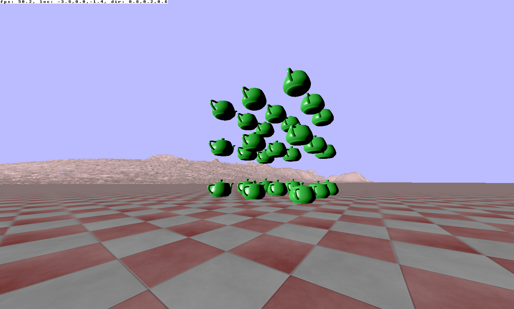

# gl-demo

This is a sample OpenGL program written in Rust using the Glium library.

It implements a very simple renderer and world (consisting of an array of
teapots) with sketched out first-person camera controls.

